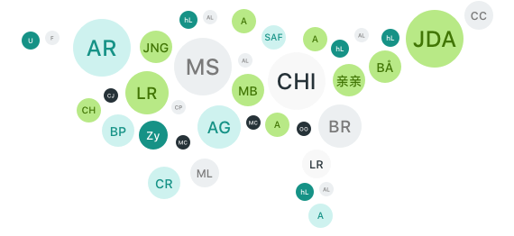

# 🧔 Astro UI Avatars



[![version][version-badge]][npm]
[![downloads][downloads-badge]][npm]
[![github actions][github-actions-badge]][github-actions]
[![typescript][typescript-badge]][typescript]
[![makepr][makepr-badge]][makepr]

This [Astro](https://astro.build/) package provides a component to generate user avatars with initials from names.

## 📦 Installation

Install using pnpm:

```bash
pnpm add astro-ui-avatars
```

Or using npm:

```bash
npm install astro-ui-avatars
```

Or using yarn:

```bash
yarn add astro-ui-avatars
```

## 🥑 Usage

To generate a user avatar in any of your Astro pages or components, import the `Avatar` component from `astro-ui-avatars` and use it inside your HTML:

```astro
---
import { Avatar } from 'astro-ui-avatars';
---

<html lang="en">
  <body>
    <p>User Avatar:</p>
    <Avatar name="John Doe" />
  </body>
</html>
```

## 🎨 Examples

- Generate an avatar with default settings

```astro
<Avatar name="John Doe" />
```

- Generate a blue avatar

```astro
<Avatar background="#0D8ABC" color="#fff" />
```

- Generate a random background avatar

```astro
<Avatar background="random" />
```

- Generate a rounded avatar

```astro
<Avatar rounded={true} />
```

## 📖 API Reference

| Name         | Required | Default    | Description                                                     |
| :----------- | :------: | :--------- | :-------------------------------------------------------------- |
| `name`       | `false`  | `John Doe` | The name used to generate initials.                             |
| `size`       | `false`  | `64`       | The size of the avatar in pixels.                               |
| `background` | `false`  | `#007bff`  | The background color of the avatar.                             |
| `color`      | `false`  | `#FFFFFF`  | The text color of the avatar.                                   |
| `length`     | `false`  | `2`        | The number of initials to display.                              |
| `fontSize`   | `false`  | `0.5`      | The font size of the initials in percentage. Between 0.1 and 1. |
| `rounded`    | `false`  | `true`     | Whether the avatar should have rounded corners.                 |
| `uppercase`  | `false`  | `true`     | Whether the initials should be in uppercase.                    |
| `bold`       | `false`  | `true`     | Whether the initials should be bold.                            |

All `Avatar` props are optional. If no props are provided, the avatar will use default settings.

> **Note**
>
> We have also setup an example repository available here: [playground](../../apps/playground)

## Changelog

Please see the [changelog](CHANGELOG.md) for more information on recent changes.

## Acknowledgements

Astro UI Avatars is _heavily_ inspired by [ui-avatars.com][ui-avatars]. Thanks ❤️

[npm]: https://npmjs.com/package/astro-ui-avatars
[ui-avatars]: https://ui-avatars.com

<!-- Readme Badges -->

[version-badge]: https://img.shields.io/npm/v/astro-ui-avatars.svg
[downloads-badge]: https://img.shields.io/npm/dt/astro-ui-avatars
[github-actions]: https://github.com/codiume/orbit/actions
[github-actions-badge]: https://github.com/codiume/orbit/actions/workflows/node.js.yml/badge.svg
[typescript]: https://npmjs.com/package/astro-ui-avatars
[typescript-badge]: https://img.shields.io/npm/types/astro-ui-avatars
[makepr]: https://makeapullrequest.com
[makepr-badge]: https://img.shields.io/badge/PRs-welcome-brightgreen.svg
